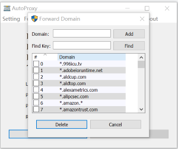
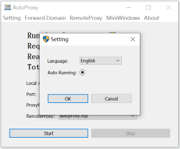

# Autoproxy

[English](./README.md)
[中文](./README_ZH_CN.md) 

The project provides browser http proxy proxy service, supports https and http protocol proxy; can deploy multi-level proxy; supports TLS protocol encryption; mainly uses tools for accessing external websites with intranet hosts;

## Features
- Support multiple forwarding modes
- Support statistical Console
- Support secondary forwarding
- Support TLS transmission encryption
- Support dynamic routing
- Support custom forwarding domain name settings
- Support multiple platforms

## Deploy

### RemoteServer
- Prepare a virtual cloud host with public IP
- Specify a port for open tcp protocol access, such as 8080

### [Download Binary](https://github.com/easymesh/autoproxy/releases)

- Choose the right platform, Download the latest version；such as. `autoproxy_linux_amd64.tar.gz`
- Run `tar -zxf autoproxy_linux_amd64.tar.gz` Unzip the compressed package.
- Run `chmod + start.sh;; ./start.sh` Start the remote proxy service. The program will run in the background.

### Default service configuration
- The default current path is the log storage path
- The default bound port 8080
- TLS transmission encryption is enabled by default
- Provide two default authentication accounts


```
log:
  path: ./
  filesize: 10485760
  filenumber: 60
local:
  listen: 0.0.0.0:8080
  timeout: 30
  auth:
    - username: user1
      password: uS31k5KLh3NyfvHtFk
    - username: user2
      password: c2O9XJGG0bsJLpt6tr
  mode: local
  tls:
    enable: true
```
Of course you can modify and run again

### Download and run the windows client
- Choose the latest windows client， such as. `autoproxy_win.zip`
- Unzip and double-click to run
- Start successfully, you need to manually add remote proxy service.

#### Home windows
- Provide basic setting options
- Forwarding domain name rules
- Remote service configuration
- Minimize and hide the window
- Real-time statistics console
- Local proxy address and port settings


#### Add remote service


After the configuration is complete, you can click Test to try to test the connectivity

#### Edit forward domain

Support fuzzy matching rules, For example:

- `*.domain.*` : Middle field matching
- `*.domain.com` : Suffix match
- `www.domain.*` : Prefix match
- `www.domain.com` : Exact match




#### Multi-language support



#### Synchronously modify local Internet setting options


### Everything is ready, return to the home windows and start the service; happy you life;

### If you think this software is good, you can consider asking the author for coffee;

### [paypal.me](https://paypal.me/lixiangyun)

### Alipay


### Wechat Pay 

